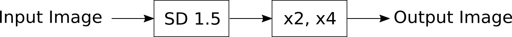
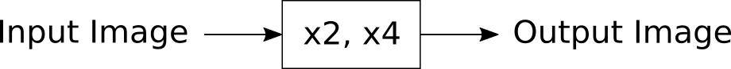

# Lazy Image Upscaler

> [!NOTE]  
> 🚧 <p align="justify">This documentation is still under construction. The documentation
> will developed up to the point the application works as expected. The last version of
> the application needs still some fine-tuning before publishing.</p>

Support my Work.  [here](## Donation)

## Preface

<p align="justify">The <i>Lazy Image Upscaler</i> is a web user interface for the 
upscaling of images. At the moment the <i>Lazy Image Upscaler</i>i> offers five
possibilities to upscale an image. One can use standard methods from OpenCV and PIL
to upscale images. Some references states that this is not working well. My experience
is different to this statement. From my point of view the results using these standard
methods are sufficient for most cases. The third and fourth method are using pretrained
models and Machine Learning approaches. To be able to work with the web user interface,
minimum one pretrained .pb model is required for the third method. At OpenCV one can find
the links for downloading such pretrained models [1]. These pretrained models can also be
found in [2-5]. The fourth method is using pretrained model which can be found at Hugging
Face. The last method is using Stable Diffusion.</p>

<p align="justify">As I am still making small changes to the layout, it cannot be said that
the illustrations reflect the latest version of the application.</p>

## Motivation

<p align="justify">I used the web user interface Easy Diffusion and I am 
using currently the web user interface AUTOMATIC1111. One integrated feature
is the possibility for upscaling of images. This is a function that is also
required in AI image generation. Depending on the hardware equipment, the
generation of images with a higher resolution is limited. The VRAM of the
GPU is the limiting factor here.</p>

<p align="justify">The use of AUTOMATIC1111 for upscaling images is complex.
For example, parameters must be selected appropriately so that the desired
result is achieved. This raised the question of whether it is possible to
upscale images fast and reliable independently of web user interfaces such
as AUTOMATIC1111.</p>

## State of the Art

<p align="justify">Graphical software tools like <i>RawTherapee</i> and <i>Gimp</i>
can be used to upscale images. During some tests I carried out, I noticed that
the images become sometimes somewhat blurred when they are upscaled. However, 
one can only recognise this if one make a direct comparison with the original
image.</p>

<p align="justify">Another way for the upscaling of image is using Artificial
Inteligence. A distinction can be made between two approaches. Direct use of
pretrained models from machine learning. It is also possible to use special
diffusion models such as the Stable Diffusion models for upscaling.</p>

## Introduction

<p align="justify">The tabs are arranged according to Logic (see Figure 1):</p>

* Standard methods (numerical interpolation methods) on base of OpenCV and PIL
* Methods using pretrained models from Machine Learning on base of OpenCV and
  super-image
* Method based on Stable Diffusion upscaler models

## Installation

<p align="justify">Clone this repository to a local location of of your choice.
Then you need some pertrained models, which has to placed in the directory
resources. After that yu are ready to work with the web UI.</p>

<p align="justify">Clone e.g. the repository</p>

<pre>https://github.com/zentrocdot/LazyImageUpscaler.git</pre>

<p align="justify">or download the zip file:</p>

<pre>LazyImageUpscaler-main.zip</pre>

## Start

<p align="justify">Use <code>start_webui.bash</code> in the main directory
to start the local server. If there is a problem one can move into the
subdirectory scripts. From there <code>lazy_image_upscaler.py</code> can
be started.</p>

<p align="justify">Open a webbrowser and open localhost on</p>

<pre>http://127.0.0.1:7860</pre>

<p align="justify">If everything was okay so far, the web UI starts 
in the browser windwow.</p>

## Control of the Web User Interface

<p align="justify">You can control the size of the visible area of
the window where the application is shown using keyboard shortcuts. 
Zoom in can be done by <kbd>CTRl++</kbd>
and zoom out can be done by <kbd>CTRl+-</kbd>.</p>

## Implemented Methods

### Numerical Interpolation Methods

#### OpenCV Related to First Tab

<p align="justify">OpenCV can be used for upscaling images. In OpenCV
implemented methods for doing this are:</p>

* INTER_NEAREST
* INTER_LINEAR
* INTER_AREA
* INTER_CUBIC
* INTER_CUBIC

#### PIL Related to Second Tab

<p align="justify">In addition to OpenCV, pillow or PIL can also be
used for upscaling images. In pillow implemented methods are:</p>

* NEAREST
* BOX
* BILINEAR
* HAMMING
* BICUBIC
* LANCZOS"

See [12] for a description of the interpolation methods.

## Pretrained Models

<p align="justify">Pretrained models which can be used are:<p align="justify">

* EDSR
* ESPCN
* FSRCNN
* LAPSRN

## Web UI

<p align="justify">The web UI is simple to use. One can select the pretrained model from a dropdown list. Per drag and drop or per upload the image can be loaded. Using the Upscale Image button scales the image up. Download Image downloads the image to the local storage.</p>

<a target="_blank" href=""></a>
<p><i>Figure 1: Web userinterface in a web browser</i></p>

## Download Images

<p align="justify">When a download is done image names looks like:</p>

2024-11-13_16:32:48.931703.jpg

<p align="justify">To make sure that each image is unique I am using the date, the time and the remaining microseconds as filename. The formatstring is:</p>

<pre>"%Y-%m-%d_%H:%M:%S.%f"</pre>

<p align="justify">The downloaded images can be found in the folder <code>outputs</code>.</p>

## Repository Structure

The repository structure is as follows

```
LazyImageUpscaler
    ├── scripts
    ├── resources
    ├── outputs
    ├── test_images
    ├── upscaler_examples
    └── images
```

<p align="justify">In the folder <code>scripts</code> there are four Python scripts, which can be used to download the models into the <code>resources</code> folder directly.</p>

<p align="justify">Under the main branch there are four directories. In scripts are the Python scripts for the web user interface. In resources there can be the .pb models be stored. After the installation this directory is empty. Created images are saved in outputs. images is the directory where documentation related images are stored.</p>

## Test Environment

<p align="justify">I developed and tested the Python script with following specification:</p>

* Linux Mint 21.3 (Virginia)
* Python 3.10.14
* OpenCV 4.10.0
* PIL 11.0.0
* Gradio 5.6.0
* Torch 2.4.1+cu121
* Numpy  2.1.3
* Chromium Browser (and others)
* Monitor with a resolution of 1366 x 768 pixel

## Time Consumption

The numerical approaches are the fastest. The AI approach is the one which takes the most time.

## Power consumption

The numerical approaches use the CPU and not the GPU, so this approach saves energy. Machine Learning
and AI use the GPU extensivly and have a high power consumption.

## Limitations

<p align="justify">In the Machine Learning Tabs and in the AI Tab there are input images 
larger than 512 x 512 pixel problematic.</p>

## Known Problems

<p align="justify">The critical parts of the software are the parts that use the GPU. In this
sense, three upscaling approaches are critical. Two approaches are using pretrained models from
Machine Learning and one is the well know AI approach.</p>

<p align="justify">Common errors if on talks about the GPU usages are.</p>

* RuntimeError
* OutOfMemorError 

## Installations Prerequisites

<p align="justify">Following Python requirements have to be fulfilled, that the Lazy Image upscaler is working:</p>

* gradio
* pil
* opencv
* piexif
* diffuser
* super-image

I am assuming that PIP is installed. Installation:

<pre>pip3 install upgrade pip</pre>

<pre>
    pip3 install gradio
    pip3 install pillow
    pip3 install opencv-contrib-python
    pip3 install piexif
    pip3 install diffuser
    pip3 install super_image
    pip3 install transformer
</pre>

Local installation can be found in hidden directory .local in the user's main directory. Changes here may result in problems while running the application.

## Stable Diffusion Upscaler Model

> [!IMPORTANT]
> Execute only one instance of Stable Diffusion on the GPU. Otherwise upscaling will fail.


### Implemented Approaches

<a target="_blank" href=""></a>
<p><i>Figure 2: Web userinterface in a web browser</i></p>


<a target="_blank" href=""></a>
<p><i>Figure 3: Web userinterface in a web browser</i></p>


### Model Installation

#### stable-diffusion-x4-upscaler

<p align="justify">Move to directory LazyImageUpscaler/stabilityai. Perform following steps.</p> 

```bash
# Make sure you have git-lfs installed (https://git-lfs.com).
git lfs install
```

```bash
# Clone the repository.
git clone https://huggingface.co/stabilityai/stable-diffusion-x4-upscaler
```

```bash
# If you want to clone without large files - just their pointers.
GIT_LFS_SKIP_SMUDGE=1 git clone https://huggingface.co/stabilityai/stable-diffusion-x4-upscaler
```

#### sd-x2-latent-upscaler

<p align="justify">Move to directory LazyImageUpscaler/stabilityai. Perform following steps.</p> 

```bash
# Make sure you have git-lfs installed (https://git-lfs.com).
git lfs install
```

```bash
# Clone the repository.
git clone https://huggingface.co/stabilityai/sd-x2-latent-upscaler
```

```bash
# If you want to clone without large files - just their pointers.
GIT_LFS_SKIP_SMUDGE=1 git clone https://huggingface.co/stabilityai/sd-x2-latent-upscaler
```

#### stable-diffusion-v1-5

<p align="justify">Move to directory LazyImageUpscaler/stabilityai. Perform following steps.</p> 

```bash
# Make sure you have git-lfs installed (https://git-lfs.com).
git lfs install
```

```bash
# Clone the repository.
git clone https://huggingface.co/stabilityai/stable-diffusion-v1-5
```

```bash
# If you want to clone without large files - just their pointers.
GIT_LFS_SKIP_SMUDGE=1 git clone https://huggingface.co/stable-diffusion-v1-5/stable-diffusion-v1-5
```

## Directory Structure

<p align="justify">The directory structure of the <i>Lazy Image Upscaler</i>
is looking as follows:</p> 

```bash
    └── LazyImageUpscaler
        │    └── start_webui.bash
        ├── scripts
        │    └── LazyImageUpscaler.py
        ├── configs
        │    └── LazyImageUpscaler.config
        ├── tools      
        │    ├── get_edsr.py
        │    ├── get_escpn.py
        │    ├── get_fsrcnn.py
        │    ├── get_lapsrn.py
        │    └── remove-metadata.bash 
        ├── test-images
        │    ├── vulture.jpg
        │    ⫶
        │    └── shedevil.jpg 
        ├── outputs
        ├── super-resolution
        │     ├── EDSR_x2.pb
        │     ├── EDSR_x4.pb  
        │     ├── ESPCN_x2.pb
        │     ├── ESPCN_x4.pb
        │     ├── FSRCNN_x2.pb
        │     ├── FSRCNN_x4.pb
        │     ├── LapSRN_x2.pb
        │     └── LapSRN_x4.pb
        ├── super-image
        │    ├── carn
        │         ├── pytorch_model_2x.pt
        │         └── pytorch_model_4x.pt
        │    ├── edsr
        │         ├── pytorch_model_2x.pt
        │         └── pytorch_model_4x.pt
        │    └── pan
        │         ├── pytorch_model_2x.pt
        │         └── pytorch_model_4x.pt
        └── stabilityai
             ├── stable-diffusion-x4-upscaler
             ├── sd-x2-latent-upscaler
             └── stable-diffusion-v1-5
```

<p align="justify">The folders super-resolution, super-image and stabilityai
are by default empty. There can be the pretrained models placed as well as the
upscaler model.</p> 

<p align="justify">The directory tree shows how a tree looks, wenn some files
are downloaded.</p> 

## Troubleshooting

### Web UI

<p align="justify">In the case of unexpected persistent problems, shut down 
the Gradio server in the terminal window. After relaunch of the Gradio server,
refresh the browser window.</p>

<p align="justify">If there is a problem with the server and with the port, one can
change both values in the source code e.g. from</p>

<code>webui.launch(server_name="127.0.0.1", server_port=7865)</code>

<p align="justify">to</p> 

<code>webui.launch()</code>

in the script <code>LazyImageUpscaler.py</code> in the directory <code>/scripts</code>.

### Super Resolution

The error message

<code>module cv2.cv2 has no attribute dnn_superres</code>

or similiar error messages can be handeled as desribed bwlow. This error occured appeared from one moment to the next 
without me being able to understand why the error message occurred.

Following solved this problem:

<pre>
pip uninstall opencv-python
pip uninstall opencv-contrib-python
</pre>

Then install latest version of OpenCV with pip3:

<pre>
pip3 install opencv-contrib-python
</pre>

### Super Image

Error:

ImportError: cannot import name cached_download from huggingface_hub

Possible Solution:

pip install huggingface_hub==0.25.00
pip3 install -U sentence-transformers

### Stable Diffusion

<p align="justify">The more I go in the direction of AI image upscaling,
the greater the problems with setting up the computer to get the desired 
result.</p>

<p align="justify">A big problem that I had before, independent of my
application, is a problem in the mismatch of version numbers of Python
modules. If I install one module, the other is uninstalled. So it is
tricky until the system runs with all required modules.</p>

<p align="justify">The error messages and solution approaches reflect
this problem.</p>

Error:

cannot import name 'CpuOffload' from 'accelerate.hooks'

Possible Solution:

pip install git+https://github.com/huggingface/accelerate.git

Error:

AttributeError: StableDiffusionControlNetPipeline object has no attribute enable_vae_tiling

Possible Solution:

pip install git+https://github.com/huggingface/diffusers.git@main

## Spin-Off

<p align="justify">The internal structure of the script is organised
in such a way that the user interface can be expanded to include additional 
methods for upscaling. In principle, the basic structure can always be 
adopted. Essentially, fields for input parameters must be adapted and the
upscaler integrated as a function.</p> 

## To-Do

<p align="justify">So far I integrated the possibility to compare two
images with respect to there quality. I need a separate independent
Python tool, which is able to compare images from different sources 
like <i>Gimp</i> and <i>RawTherapee</i> with the original image. This
is important to compare the results of my web user interface with the
state of the art software tools.</p>

<p align="justify">Improvement of this documentation. The web UI has
to checked that it is more fail safe. The current work was quick and
dirty programming. I need to sanitize and optimize the code.</p>

## Outlook

I need to take a deepler look in how ESRGAN works. I tried to get it
run on the quickly, but this failed for the moment. An implementation
in Python will give me further possibilities for upscaling. Initial
tests show interesting results. 

## Free for Contributions

<p align="justify">Due to a lack of time, I can only develop my tools
in between. If anyone would like this tool to be developed further,
the best way is to support me with a donation as mentioned below. Then
I can concentrate on these things and don't have to do anything else.
</p>

## General Note

<p align="justify">All company names, brands, brand names and trademarks
mentioned in this documentation belong to their respective owners. This
application is an independently developed software product by the author.
</p>

## References

[1] https://github.com/opencv/opencv_contrib/tree/master/modules/dnn_superres

[2] https://github.com/Saafke/EDSR_Tensorflow/tree/master/models

[3] https://github.com/fannymonori/TF-ESPCN/tree/master/export

[4] https://github.com/Saafke/FSRCNN_Tensorflow/tree/master/models

[5] https://github.com/fannymonori/TF-LapSRN/tree/master/export

[6] https://github.com/cyc0102/opencv_super_resolution/tree/master

[7] https://huggingface.co/

[8] https://pypi.org/project/super-image/

[9] https://huggingface.co/stabilityai/sd-x2-latent-upscaler

[10] https://huggingface.co/stabilityai/stable-diffusion-x4-upscaler

[11] https://huggingface.co/stable-diffusion-v1-5/stable-diffusion-v1-5

[12] https://pillow.readthedocs.io/en/stable/reference/Image.html

[13] https://pillow.readthedocs.io/en/stable/handbook/concepts.html

[14] https://scikit-image.org/

<hr width="100%" size="2">

## Donation

<p align="justify">If you like what I present here, or if it helps you,
or if it is useful, you are welcome to donate a small contribution. Or
as you might say: Every TRON counts! Many thanks in advance! :smiley:</p>

<pre>TQamF8Q3z63sVFWiXgn2pzpWyhkQJhRtW7            (TRON)
DMh7EXf7XbibFFsqaAetdQQ77Zb5TVCXiX            (DOGE)
12JsKesep3yuDpmrcXCxXu7EQJkRaAvsc5            (BITCOIN)
0x31042e2F3AE241093e0387b41C6910B11d94f7ec    (Ethereum)</pre>
