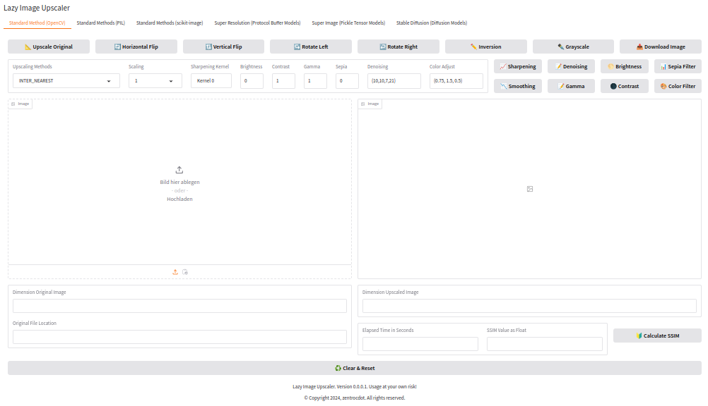
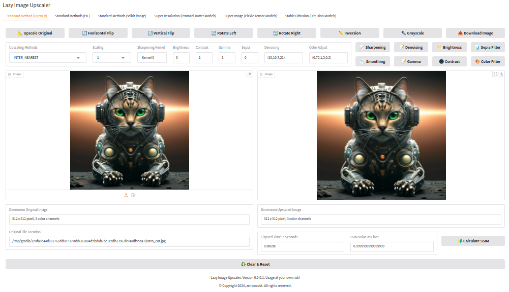

# Lazy Image Upscaler []()

[](https://www.python.org/downloads/release/python-31014/)
[](https://pypi.org/)
[](https://www.gradio.app/)

> [!IMPORTANT]  
> <p align="justify">🚧 This documentation is still under construction. The
> documentation will developed up to the point the application works as expected.
> The last version of the application needs also some fine-tuning after publishing
> here.</p>
 
<b><p align="justify">If you like what I present here, or if it helps you, or if it is
useful, you are welcome to [donate](#Donation) a small contribution. It motivates me a lot
and speeds up my work a much.</p></b>

## Preface

<p align="justify">The <i>Lazy Image Upscaler</i> is a web user interface
for the upscaling of images written using the programming language Python.
A bunch of Internet browsers can be used to run the <i>Lazy Image Upscaler</i>.
At the moment the <i>Lazy Image Upscaler</i> offers six possibilities to upscale
an image.</p>

<p align="justify">One can use for the upscaling of images standard methods from
OpenCV, PIL and scikit-image whereas scikit-image is a little bit exotic. Some 
references states that this is not working well. My experience is different to this
statement. From my point of view the results using these standard methods are
sufficient for most cases. The fourth and fifth method are using pretrained models 
and Machine Learning approaches. To be able to work with the web user interface, at 
least minimum one of such a pretrained model is required for the fourth and fifth 
method. At OpenCV one can find the links to GitHub for downloading such pretrained
models for the fourth method. The fifth method is also using pretrained model which
can be found at Hugging Face. The last method is using Stable Diffusion. I implemented
the possibility to use a 2 times and 4 times latent upscaler for upscaling. And I added
a pipeline for upscaling which can use SD 1.5 together with the 2 time latent upscaler.
Both upscaler models as well as the SD 1.5 needs to be downloaded and installed in the
directory tree of the repository.</p>

<p align="justify">As I am still making small changes to the layout, it cannot be 
said that the illustrations reflect the latest version of the application.</p>

## Motivation

<p align="justify">I used the web user interface <i>Easy Diffusion</i> and I am using
currently the web user interface <i>AUTOMATIC1111</i>. One integrated feature of both
web user interfaces  is the possibility for upscaling of images. This is a function 
that is in general required in nowadays AI image generation. Depending on the existing
hardware equipment, the generation of AI images with a higher resolution is limited.
The VRAM  memory of the GPU on the graphic card in use is the limiting factor here.</p>

<p align="justify">Using a web user interface such as <i>AUTOMATIC1111</i> to upscale 
images is complex, time-consuming and energy-intensive.  The time required for a
conventional computer system should not be underestimated, even if energy consumption
is not an issue. For example, parameters have to be selected appropriately to achieve
the desired result. These points raised the question of whether it is possible to scale
up images appropriately, quickly and reliably independently of user interfaces such as
<i>AUTOMATIC1111</i>. This application provides an answer to this question.</p>

<p align="justify">It is important to note that it is important to preserve the original 
<i>Exif metadata</i> when upscaling. This is not possible by default with <i>AUTOMATIC1111
</i>.</p>

> [!NOTE]  
> <p align="justify">I assume in all descriptions that a computer system with
> <i>Linux</i> as operating system is used. Basic knowledge of installing software
> on such a computer system is a prerequisite, as is the use of terminal emulators.</p>

## Introduction

<p align="justify">The Lazy Image Upscaler offers the possibility to upscale images.
Base don the fact that the application is intendet for use with AI generated images
the upscaling factor is an integer. Floating point numbers cannot be used for upscaling.  
</p>

<p align="justify">The tabs of the web UI are arranged according to logic of the
implemented methods for upscaling (see Figure 1):</p>

* Tab 1 to Tab 3
  + Standard methods (numerical interpolation methods) on base of OpenCV, PIL and scikit-image
* Tab 4 to Tab 5 
  + Methods using pretrained models from Machine Learning on base of OpenCV and super-image
* Tab 6 
  + Methods based on a Stable Diffusion model and Stable Diffusion upscaler models

## Brief Introduction of the State of the Art

<p align="justify">Graphical software tools like <i>RawTherapee</i> and 
<i>GIMP</i> can be used to upscale images. During some tests I carried out,
I noticed that the images become sometimes somewhat blurred when they are
upscaled. However, one can only recognise this if one make a direct comparison
with the original image.</p>

<p align="justify">Another way for the upscaling of image is using Artificial
Inteligence. A distinction can be made between two approaches. Direct use of
pretrained models from machine learning. It is also possible to use special
diffusion models such as the Stable Diffusion models for upscaling.</p>

<p align="justify">Every programming language has its own way to handle
downscaling or upscaling of images. In the context of this application, I will
limit myself to the possibilities offered by <i>Bash</i> in combination with 
<i>Python</i>.</p>

## Presumption

<p align="justify">Use a computer system with a Linux version as operating system
which is state of the art. Install Python 3.10 or higher if you want to use the
Lazy Image Upscaler. Some third-party modules are also required. Prtrained models 
as well as diffusion models can be installed later.</p>

> [!Note]  
> <p align="justify">The installed Python version must bei 3.10 or higher.
> Otherwise the application will not working. The in the code used Match
> Case statement was introduced in Python 3.10.</p>

## Installation of The Web UI

<p align="justify">Clone the repository to a local location of of your choice.
Therefore move to the locoation of your choice. Then run the following command:</p>

```bash
git clone https://github.com/zentrocdot/LazyImageUpscaler.git
```
<p align="justify">Afterwards you are ready to use the application.
As alternative you can also download the zip-file with the repository.</p>

```bash
LazyImageUpscaler-main.zip
```

<p align="justify">Extract the zip-file to a location of your choice. Preserve
the directory structure. Then it is propsed to rename the main directory which is</p>

```bash
LazyImageUpscaler-main
```
to

```bash
LazyImageUpscaler
```

<p align="justify">In both cases you are ready to use the application.</p>

<p align="justify">The base modules will work out of the box after installation.
The modules which are using pretrained models and the diffusion models will work
after download of these models. How to do this is described later.</p>

## Installation of the Required Python Dependencies

<p align="justify">Following Python requirements have to be fulfilled,
that the Lazy Image upscaler is working:</p>

* gradio
* numpy
* PIL
* opencv
* skimage
* piexif
* SSIM_PIL
* super_image
* diffusers
* torch

<p align="justify">Install the Python dependencies using pip (pip3). Do not
install the modules as sudo.</p>

<p align="justify">First update pip. It could be that you have to update 
pip also in between.</p>

```bash
pip3 install --upgrade pip
```
<p align="justify">Afterwards you can install most of the dependencies.</p>

```bash
pip3 install gradio
pip3 install opencv-contrib-python
pip3 install numpy
pip3 install pillow
pip3 install piexif
pip3 install SSIM_PIL
pip3 install diffusers
pip3 install torch
```

<p align="justify">For scikit-image you have to perform following steps.</p>

```bash
# Update pip
python -m pip install -U pip
# Install scikit-image
python -m pip install -U scikit-image
```

<p align="justify">Everything will be installed to a local location,
which ma look like:</p>

<code>./.local/lib/python3.10/site-packages</code> 

<p align="justify">The local installation can be found in the hidden
directory <code>.local</code> in the user's main directory. Changes
here may result in problems while running the application.</p>

> [!TIP]  
> <p align="justify">If you do not want to install <i>torch</i> or
> <i>diffusers</i>, disable super-image and Stable Diffusion in the
> config file.</p>

## Start

<p align="justify">Use <code>start_webui.bash</code> in the main directory
to start the local server. If there is a problem one can move into the
subdirectory scripts. From there <code>lazy_image_upscaler.py</code> can
be started.</p>

<p align="justify">Open a webbrowser and open localhost on</p>

<pre>http://127.0.0.1:7865</pre>

<p align="justify">If everything was okay so far, the web UI starts 
in the browser window.</p>

## Control of the Web User Interface

<p align="justify">You can control the size of the visible area of
the window where the application is shown using keyboard shortcuts. 
Zoom in can be done by <kbd>CTRl++</kbd> and zoom out can be done by
<kbd>CTRl+-</kbd>.</p>

## Configuration of the Interface

<p align="justify">In the directory <code>/configs</code>there is a 
configuration file that can be used to make various settings</p>

```bash
# Lazy Image Upscaler configuration file
# --------------------------------------

# Output related parameter.
isRawImage = False
isExifImage = True
isChopsImage = False

# Image related parameter
JpgQuality = 70

# Tab related parameter.
isOpencvTab = True
isPilTab = True
isScikitTab = True
isSuperResolutionTab = True
isSuperImageTab = True
isStableDiffusionTab = True

# Safetensor related parameter.
SafeTensor = False 

Scikit related parameter.
AntiAliasing = False
```

<p align="justify">By setting the corresponding value 
to False, individual Tabs can be deactivated in the 
user interface.</p>

## Implemented Methods

### Numerical Interpolation Methods

#### OpenCV Interpolation Methods Related to the First Tab [](https://docs.opencv.org/4.10.0/da/d54/group__imgproc__transform.html)

<p align="justify">OpenCV can be used for upscaling images. The in OpenCV
implemented interpolation methods for resizing are:</p>

* INTER_NEAREST
* INTER_LINEAR
* INTER_AREA
* INTER_CUBIC
* INTER_LANCZOS4
* INTER_LINEAR_EXACT
* INTER_NEAREST_EXACT

<p align="justify">The interpolation methods can by selected over a drop-down menu.</p>

#### PIL Interpolation Methods Related to the Second Tab [](https://pillow.readthedocs.io/en/stable/reference/Image.html)

<p align="justify">In addition to OpenCV, pillow or PIL can also be
used for upscaling of images. The in pillow implemented interpolation
methods are:</p>

* NEAREST
* BOX
* BILINEAR
* HAMMING
* BICUBIC
* LANCZOS

<p align="justify">The interpolation methods can by selected over a drop-down menu.</p>

#### skimage Interpolation Methods Related to the Second Tab [](https://scikit-image.org/docs/stable/api/skimage.transform.html#skimage.transform.resize)

* NEAREST-NEIGHBOR
* BI-LINEAR
* BI-QUDRATIC
* BI-CUBIC
* BI-QUARTIC
* BI-QUINTIC

### Machine Learning Methods

#### Pretrained Models (OpenCV)

<p align="justify">Pretrained models which can be used are:</p>

* EDSR
* ESPCN
* FSRCNN
* LAPSRN

#### Pretrained Models (super-image)

<p align="justify">Predefined in the directory structure are:</p>

+ a2n
+ awsrn-bam
+ carn
+ carn-bam
+ drln 
+ drln-bam
+ edsr
+ edsr-base
+ han
+ mdsr
+ mdsr-bam
+ msrn
+ msrn-bam
+ pan
+ pan-bam
+ rcan-bam

### Stable Diffusion Methods

<p align="justify"> Stable Diffusion model and Upscalers are:</p>

+ stable-diffusion-v1-5
+ sd-x2-latent-upscaler
+ stable-diffusion-x4-upscaler 

## Web UI

<p align="justify">The web UI is simple to use. One can select the pretrained model from a dropdown list. Per drag and drop or per upload the image can be loaded. Using the Upscale Image button scales the image up. Download Image downloads the image to the local storage.</p>

<a target="_blank" href=""></a>
<p><i>Figure 1: Web userinterface in a web browser without image</i></p>

<a target="_blank" href=""></a>
<p><i>Figure 2: Web userinterface in a web browser with image and upscaled image</i></p>

## Download Upscaled Images and Name Convention

<p align="justify">When a download is done image names looks like:</p>

2024-11-13_16:32:48.931703.jpg

<p align="justify">To make sure that each image is unique I am using the date, the time and the remaining microseconds as filename. The formatstring is:</p>

<pre>"%Y-%m-%d_%H:%M:%S.%f"</pre>

<p align="justify">The downloaded images can be found in the folder <code>outputs</code>.</p>

## Additional Implemented Features

### Implemented Features

<p align="justify">In addition to upscaling images, rudimentary
image editing is also possible with the application. These features
are:</p>

+ Horizontal Flip
+ Vertical Flip
+ Rotate Left
+ Rotate Right
+ Inversion
+ Grayscale
+ Brightness
+ Contrast
+ Sharpening
+ Smoothing
+ Gamma
+ Denoising
+ Sepia Filter
+ Color Filter

### Horizontal and Vertical Flip

<p align="justify">Horizontal Flip and Vertical Flip are mirroring an image in horizontal and vertical direction.</p>

### Rotate Left and Right

<p align="justify">Rotate Left and Rotate Right are rotating an image in clockwise and anti-clockwise by an angle of 90°
</p>

### Inversion

<p align="justify">Inversion is inverting an image.</p>

### Grayscale

<p align="justify">Grayscale creates an image in grayscale from the original.</p>

### Brightness

<p align="justify">to-do ...</p>
### Contrast

<p align="justify">to-do ...</p>

### Sharpening

<p align="justify">to-do ...</p>

### Smoothing

<p align="justify">to-do ...</p>

### Gamma

<p align="justify">Gamma is a classical Gamma correction.</p>

### Denoising

<p align="justify">to-do ...</p>
 
### Sepia Filter

<p align="justify">The sepia filter looks like:</p>

<code>
    sepia_matrix = [[0.393, 0.769, 0.189],
                    [0.349, 0.686, 0.168],
                    [0.272, 0.534, 0.131]]

    correct_matrix = [[0.607, -0.769, -0.189],
                      [-0.349, 0.314, -0.168],
                      [-0.349, -0.534, 0.869]]
</code>

<code> sepia_filter = sepia_matrix + scalar * correct_matrix </code>

<p align="justify">Valid values are in a range [0,1]</p>

### Color Filter

<p align="justify">The color filter is using a HSV color model.
HSV is the abbreviation for Hue-Saturation-Value. This color model 
is different to the well known RGB or BGR color which is often used. 
models. The HSV color model is using Hue, Saturation and Value for
the description of the colors as the abbreviation states.</p> 
 
<p align="justify">To use the color filter one needs some parameters.
These parameters/values are:</p>

- Hue
- Saturation
- Value

<p align="justify">By default this vaules are set to:</p>

<code>(0.75,1.5,0.5)</code>

<p align="justify">The values have to be given as a tuple (triple).
If not no image is modified and a warning is shown.</p>

<p align="justify">Simply spoken, the Color filter is able, to modify or
shift the colors. The colors range from red (0) to magenta (1). To check this out use:</p>

<code>(0.5,1,1)</code>

<p align="justify">If Saturation is 1 and Value is also one, the color is shifted to green/cyan value.</p>

<p align="justify">The following values can be taken as a guide.</p>

* Red 0.0 - 0.17
* Yellow 0.17 - 0.33
* Green 0.33 - 0.5
* Cyan 0.5 - 0.67
* blue 0.67 - 0.83
* Magenta 0.83 - 1.0
* 1.0 (image colors remains unchanged)

<p align="justify">Values outside the interval [0,1] will lead to colour distortion and false colours</p>

<p align="justify">A value for the Saturation 0f 0.0 will give a grayscale image.</p>

<code>(1,0,1)</code>

<p align="justify">A value for the Value 0f 0.0 will give a pure black image.</p>

<code>(1,1,0)</code>

<p align="justify">Values outside the interval [0,1] will lead to colour distortion and false colours for Saturation and Value.</p>

<p align="justify">Other color models next to HSV e.g. are:</p>

- RGB (red, green, blue) 
- BGR (blue, green, red)
- CMYK (cyan, magenta, yellow, black)
- HSL (hue, saturation, lightness)
- YIQ (luminance, in-phase, quadrature)

### Comments on the Special Features

#### Horizontal and Vertical Flip

<p align="justify">The horizontal and vertical flip of an image goes hand in hand with a loss of quality.</p>

## Test Environment

<p align="justify">I developed and tested the Python script with following specification:</p>

* Linux Mint 21.3 (Virginia)
* Python 3.10.14
* OpenCV 4.10.0
* PIL 11.0.0
* Gradio 5.6.0
* Torch 2.4.1+cu121
* Numpy  2.1.3
* Chromium Browser, Firefox and Google Chrome
* Monitor with a resolution of 1366 x 768 pixel

## Time Consumption

The numerical approaches are the fastest. The AI approach is the one which takes the most time.

## Power consumption

The numerical approaches use the CPU and not the GPU, so this approach saves energy. Machine Learning
and AI use the GPU extensivly and have a high power consumption.

## Limitations

<p align="justify">In the Machine Learning Tabs and in the AI Tab there are input images 
larger than 512 x 512 pixel problematic.</p>

## Known Problems

<p align="justify">The critical parts of the software are the parts that use the GPU. In this
sense, three upscaling approaches are critical. Two approaches are using pretrained models from
Machine Learning and one is the well know AI approach.</p>

<p align="justify">Common errors if on talks about the GPU usages are.</p>

* RuntimeError
* OutOfMemorError 

## Super Image [](https://pypi.org/project/super-image/)

<p align="justify">to-do ....</p> 

## Super Resolution [](https://learnopencv.com/super-resolution-in-opencv/)

<p align="justify">to-do ....</p> 

## Stable Diffusion Upscaler Model

> [!IMPORTANT]
> Execute only one instance of Stable Diffusion on the GPU. Otherwise upscaling will fail.

### Implemented Approaches

<a target="_blank" href=""></a>
<p><i>Figure 2: Web userinterface in a web browser</i></p>


<a target="_blank" href=""></a>
<p><i>Figure 3: Web userinterface in a web browser</i></p>

## Pretrained Model Installation

#### stable-diffusion-x4-upscaler

<p align="justify">Move to directory LazyImageUpscaler/stabilityai. Perform following steps.</p> 

```bash
# Make sure you have git-lfs installed (https://git-lfs.com).
git lfs install
```

```bash
# Clone the repository.
git clone https://huggingface.co/stabilityai/stable-diffusion-x4-upscaler
```

```bash
# If you want to clone without large files - just their pointers.
GIT_LFS_SKIP_SMUDGE=1 git clone https://huggingface.co/stabilityai/stable-diffusion-x4-upscaler
```

#### sd-x2-latent-upscaler

<p align="justify">Move to directory LazyImageUpscaler/stabilityai. Perform following steps.</p> 

```bash
# Make sure you have git-lfs installed (https://git-lfs.com).
git lfs install
```

```bash
# Clone the repository.
git clone https://huggingface.co/stabilityai/sd-x2-latent-upscaler
```

```bash
# If you want to clone without large files - just their pointers.
GIT_LFS_SKIP_SMUDGE=1 git clone https://huggingface.co/stabilityai/sd-x2-latent-upscaler
```

#### stable-diffusion-v1-5

<p align="justify">Move to directory LazyImageUpscaler/stabilityai. Perform following steps.</p> 

```bash
# Make sure you have git-lfs installed (https://git-lfs.com).
git lfs install
```

```bash
# Clone the repository.
git clone https://huggingface.co/stabilityai/stable-diffusion-v1-5
```

```bash
# If you want to clone without large files - just their pointers.
GIT_LFS_SKIP_SMUDGE=1 git clone https://huggingface.co/stable-diffusion-v1-5/stable-diffusion-v1-5
```

## Repository & Directory Structure

<p align="justify">The repository and directory structure of the <i>Lazy Image Upscaler</i>
is looking as follows:</p> 

```bash
    └── LazyImageUpscaler
        │    └── start_webui.bash
        ├── scripts
        │    └── LazyImageUpscaler.py
        ├── configs
        │    └── LazyImageUpscaler.config
        ├── tools      
        │    ├── get_edsr.py
        │    ├── get_escpn.py
        │    ├── get_fsrcnn.py
        │    ├── get_lapsrn.py
        │    └── remove-metadata.bash 
        ├── test-images
        │    ├── vulture.jpg
        │    ⫶
        │    └── shedevil.jpg 
        ├── outputs
        ├── super-resolution
        │     ├── EDSR_x2.pb
        │     ├── EDSR_x4.pb  
        │     ├── ESPCN_x2.pb
        │     ├── ESPCN_x4.pb
        │     ├── FSRCNN_x2.pb
        │     ├── FSRCNN_x4.pb
        │     ├── LapSRN_x2.pb
        │     └── LapSRN_x4.pb
        ├── super-image
        │    ├── carn
        │         ├── pytorch_model_2x.pt
        │         └── pytorch_model_4x.pt
        │    ├── edsr
        │         ├── pytorch_model_2x.pt
        │         └── pytorch_model_4x.pt
        │    └── pan
        │         ├── pytorch_model_2x.pt
        │         └── pytorch_model_4x.pt
        └── stabilityai
             ├── stable-diffusion-x4-upscaler
             ├── sd-x2-latent-upscaler
             └── stable-diffusion-v1-5
```

<p align="justify">In the folder <code>scripts</code> there are four Python scripts,
which can be used to download the models into the <code>resources</code> folder directly.</p>

<p align="justify">Under the main branch there are four directories. In scripts are the
 Python scripts for the web user interface. In resources there can be the .pb models be 
 stored. After the installation this directory is empty. Created images are saved in outputs.
 images is the directory where documentation related images are stored.</p>

<p align="justify">The folders super-resolution, super-image and stabilityai
are by default empty. There can be the pretrained models placed as well as the
upscaler model.</p> 

<p align="justify">The directory tree shows how a tree looks, wenn some files
are downloaded.</p>

## Troubleshooting

### Web UI

<p align="justify">In the case of unexpected persistent problems, shut down 
the Gradio server in the terminal window. After relaunch of the Gradio server,
refresh the browser window.</p>

<p align="justify">If there is a problem with the server and with the port, one can
change both values in the source code e.g. from</p>

<code>webui.launch(server_name="127.0.0.1", server_port=7865)</code>

<p align="justify">to</p> 

<code>webui.launch()</code>

in the script <code>LazyImageUpscaler.py</code> in the directory <code>/scripts</code>.

### Super Resolution

The error message

<code>module cv2.cv2 has no attribute dnn_superres</code>

or similiar error messages can be handeled as desribed bwlow. This error occured appeared from one moment to the next 
without me being able to understand why the error message occurred.

Following solved this problem:

<pre>
pip uninstall opencv-python
pip uninstall opencv-contrib-python
</pre>

Then install latest version of OpenCV with pip3:

<pre>
pip3 install opencv-contrib-python
</pre>

### Super Image

<p align="justify">Error:<p align="justify">

```
ImportError: cannot import name cached_download from huggingface_hub
```

<p align="justify">Possible Solution:<p align="justify">

```
pip3 install huggingface_hub==0.25.00
pip3 install -U sentence-transformers
```

### Stable Diffusion

<p align="justify">The more I go in the direction of AI image upscaling,
the greater the problems with setting up the computer to get the desired 
result.</p>

<p align="justify">A big problem that I had before, independent of my
application, is a problem in the mismatch of version numbers of Python
modules. If I install one module, the other is uninstalled. So it is
tricky until the system runs with all required modules.</p>

<p align="justify">The error messages and solution approaches reflect
this problem.</p>

<p align="justify">Error:<p align="justify">

```
cannot import name CpuOffload from accelerate.hooks
```

<p align="justify">Possible Solution:<p align="justify">

```
pip install git+https://github.com/huggingface/accelerate.git
```

<p align="justify">Error:<p align="justify">

```
AttributeError: StableDiffusionControlNetPipeline object has no attribute enable_vae_tiling
```

<p align="justify">Possible Solution:<p align="justify">

```
pip install git+https://github.com/huggingface/diffusers.git@main
```

## Spin-Off

<p align="justify">The internal structure of the script is organised
in such a way that the user interface can be expanded to include 
additional methods for upscaling. In principle, the basic structure 
can always be adopted. Essentially, fields for input parameters must
be adapted and the upscaler integrated as a function.</p> 

## To-Do

<p align="justify">So far I integrated the possibility to compare two
images with respect to there quality. I need a separate independent
Python tool, which is able to compare images from different sources 
like <i>Gimp</i> and <i>RawTherapee</i> with the original image. This
is important to compare the results of my web user interface with the
state of the art software tools.</p>

<p align="justify">Improvement of this documentation. The web UI has
to checked that it is more fail safe. The current work was quick and
dirty programming. I need to sanitize and optimize the code.</p>

## Outlook

I need to take a deepler look in how ESRGAN works. I tried to get it
run on the quickly, but this failed for the moment. An implementation
in Python will give me further possibilities for upscaling. Initial
tests show interesting results. 

## Free for Contributions

<p align="justify">Due to a lack of time, I can only develop my tools
in between. If anyone would like this tool to be developed further,
the best way is to support me with a donation as mentioned below. Then
I can concentrate on these things and don't have to do anything else.
</p>

## General Note

<p align="justify">All company names, brands, brand names and trademarks
mentioned in this documentation belong to their respective owners. This
application is an independently developed software product by the author.
</p>

## References

[1] https://github.com/opencv/opencv_contrib/tree/master/modules/dnn_superres

[2] https://github.com/Saafke/EDSR_Tensorflow/tree/master/models

[3] https://github.com/fannymonori/TF-ESPCN/tree/master/export

[4] https://github.com/Saafke/FSRCNN_Tensorflow/tree/master/models

[5] https://github.com/fannymonori/TF-LapSRN/tree/master/export

[6] https://github.com/cyc0102/opencv_super_resolution/tree/master

[7] https://huggingface.co/

[8] https://pypi.org/project/super-image/

[9] https://huggingface.co/stabilityai/sd-x2-latent-upscaler

[10] https://huggingface.co/stabilityai/stable-diffusion-x4-upscaler

[11] https://huggingface.co/stable-diffusion-v1-5/stable-diffusion-v1-5

[12] https://pillow.readthedocs.io/en/stable/reference/Image.html

[13] https://pillow.readthedocs.io/en/stable/handbook/concepts.html

[14] https://scikit-image.org/

<hr width="100%" size="2">

## Donation

<p align="justify">If you like what I present here, or if it helps you,
or if it is useful, you are welcome to donate a small contribution. Or
as you might say: Every TRON counts! Many thanks in advance! :smiley:
</p>

<p align="left">${\textnormal{\color{navy}Tron}}$</p>

```
TQamF8Q3z63sVFWiXgn2pzpWyhkQJhRtW7
```
<p align="left">${\textnormal{\color{navy}Doge}}$</p>

```
DMh7EXf7XbibFFsqaAetdQQ77Zb5TVCXiX
```
<p align="left">${\textnormal{\color{navy}Bitcoin}}$</p>

```
12JsKesep3yuDpmrcXCxXu7EQJkRaAvsc5
```
<p align="left">${\textnormal{\color{navy}Ethereum}}$</p>

```
0x31042e2F3AE241093e0387b41C6910B11d94f7ec
```
