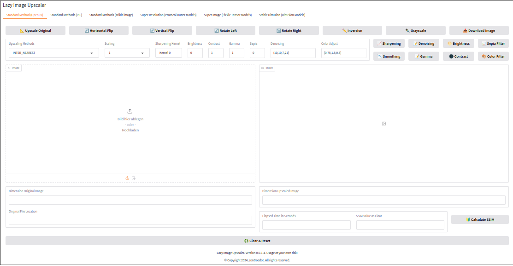

# Lazy Image Upscaler

## Preface

<p align="justify">The <i>Lazy Image Upscaler</i> is a web user interface for the upscaling of images. The upscaling is done using machine learning methods using pretrained models. To be able to work with the web user interface, minimum one pretrained .pb model is required. At OpenCV one can find the links for downloading such pretrained models [1]. These pretrained models can also be found in [2-5]. The current version of the Lazy Image Upscaler is the inital version for the web user interface.</p>

## Installation

<p align="justify">Clone this repository to a local location of of your choice. Then you need some pertrained models, which has to placed in the directory resources. After that yu are ready to work with the web UI.</p>

## Start

<p align="justify">Use <code>start_webui.bash</code> in the main directory to start the local server. If there is a problem one can move into the subdirectory 
scripts. From there <code>lazy_image_upscaler.py</code> can be started.</p>

<p align="justify">Open a webbrowser and open localhost on</p>

<pre>http://127.0.0.1:7860</pre>

<p align="justify">If everything was okay so far, the web UI starts in the browser windwow.<p align="justify">

## Pretrained Models

<p align="justify">Pretrained models which can be used are:<p align="justify">

* EDSR
* ESPCN
* FSRCNN
* LAPSRN

## Web UI

<p align="justify">The web UI is simple to use. One can select the pretrained model from a dropdown list. Per drag and drop or per upload the image can be loaded. Using the Upscale Image button scales the image up. Download Image downloads the image to the local storage.</p>

<a target="_blank" href=""></a>

## Download Images

<p align="justify">When a download is done image names looks like:</p>

2024-11-13_16:32:48.931703.jpg

<p align="justify">To make sure that each image is unique I am using the date, the time and the remaining microseconds as filename. The formatstring is:</p>

<pre>"%Y-%m-%d_%H:%M:%S.%f"</pre>

<p align="justify">The downloaded images can be found in the folder <code>outputs</code>.</p>

## Repository Structure

The repository structure is as follows

```
LazyImageUpscaler
    ├── scripts
    ├── resources
    ├── outputs
    ├── test_images
    ├── upscaler_examples
    └── images
```

<p align="justify">In the folder <code>scripts</code> there are four Python scripts, which can be used to download the models into the <code>resources</code> folder directly.</p>

<p align="justify">Under the main branch there are four directories. In scripts are the Python scripts for the web user interface. In resources there can be the .pb models be stored. After the installation this directory is empty. Created images are saved in outputs. images is the directory where documentation related images are stored.</p>

## To_Do 

<p align="justify">Improvement of this documentation. The web UI has to checked that it is more fail safe. The current work was quick and dirty programming. I need to sanitize and optimize the code.</p>

## Test Environment

<p align="justify">I developed and tested the Python script with following specification:</p>

* Linux Mint 21.3 (Virginia)
* Python 3.10.14
* Gradio 5.0.1
* Chromium Browser
* Screen 1366 x 768 pixel

## References

[1] https://github.com/opencv/opencv_contrib/tree/master/modules/dnn_superres

[2] https://github.com/Saafke/EDSR_Tensorflow/tree/master/models

[3] https://github.com/fannymonori/TF-ESPCN/tree/master/export

[4] https://github.com/Saafke/FSRCNN_Tensorflow/tree/master/models

[5] https://github.com/fannymonori/TF-LapSRN/tree/master/export

[6] https://github.com/cyc0102/opencv_super_resolution/tree/master
